# MicroFoundry

[](https://github.com/younjinjeong/microfoundry/actions/workflows/ci.yml)
[](https://github.com/younjinjeong/microfoundry/releases)
[](https://go.dev)
[](LICENSE)
[](https://github.com/younjinjeong/microfoundry/releases/latest)

**A micro CloudFoundry for Kubernetes** — lightweight PaaS that preserves the CloudFoundry developer experience while running on cloud-native infrastructure.

MicroFoundry replaces the heavyweight BOSH/Diego runtime with Kubernetes, managed cloud services, and modern observability. The result: `cf push`-style deployments, OSBAPI service binding, Loggregator-equivalent logging — all backed by Kubernetes, Prometheus, Loki, and Grafana Beyla.

> **Built with AI** — This project is developed through a structured Human-AI collaborative workflow using [Claude Code](https://claude.ai/claude-code). Every Epic goes through a 7-agent review process covering security, platform engineering, API design, frontend, DevOps, QA, and product management. See [How We Build](#how-we-build-human-ai-collaborative-development) for details.

---

## Why MicroFoundry?

| Problem | MicroFoundry Solution |
|---|---|
| **CF is too heavy** — BOSH + Diego + 20+ VMs just to run apps | **Single Go binary** on any Kubernetes cluster — laptop to cloud |
| **Losing CF developer experience** when migrating to K8s | **`mf push` works like `cf push`** — same workflow, K8s underneath |
| **Observability requires code changes** — instrumenting every app | **Zero-code eBPF metrics** — Grafana Beyla auto-instruments all HTTP traffic |
| **No visibility into platform state** without multiple tools | **Built-in admin dashboard** — apps, services, secrets, IAM, monitoring in one UI |
| **IAM is bolted on** — separate systems for auth, authz, provisioning | **Integrated Keycloak + OPA + SCIM v2** — authentication, authorization, and user provisioning in one stack |
| **Multi-cluster is hard** — different tools per cloud provider | **One control plane** — Docker Desktop, EKS, GKE, AKS from a single `mf` binary |

### Core Benefits

- **5-minute setup** — `make build && mf push` from zero to deployed app with monitoring
- **CF-compatible CLI** — 25+ commands mirror CloudFoundry (`mf push`, `mf bind-service`, `mf logs`)
- **10 backing services** — MariaDB, PostgreSQL, Redis, RabbitMQ, MinIO, and more with real K8s provisioning (StatefulSet + PVC)
- **Production-ready IAM** — Keycloak OIDC, 5-tier RBAC (platform → workspace → org → member → viewer), OPA Rego policies, SCIM v2
- **Admin dashboard with no JS build step** — Go templates + HTMX + Tailwind CSS, 16+ pages, all server-rendered
- **AI-native** — MCP Server lets Claude, Cursor, and other AI tools deploy and manage apps directly
- **Cross-platform release** — GoReleaser builds for Linux/macOS/Windows on amd64/arm64, multi-arch Docker images, Helm chart as OCI artifact
- **Cloud deployment packages** — Terraform blueprints for AWS EKS, AWS ECS Fargate, GCP GKE, Azure AKS, and local K8s

---

## Highlights

- **`mf push`** — Build and deploy from source (Dockerfile or Cloud Native Buildpacks)
- **10 backing services** — MariaDB, PostgreSQL, Redis, RabbitMQ, MinIO, Kong, and more with real K8s provisioning
- **Zero-code observability** — Grafana Beyla eBPF auto-instruments all HTTP traffic for RED metrics
- **Multi-cluster** — Manage Docker Desktop, EKS, GKE, AKS clusters from a single control plane
- **Admin Dashboard** — Full-featured web UI with HTMX (no JS build step), 16+ pages
- **Keycloak IAM** — OIDC authentication, SCIM v2 provisioning, OPA authorization, 5-tier RBAC
- **Workspace hierarchy** — Platform → Workspace → Organization → Member → Viewer role-based access
- **Pluggable gateway** — Kong, Nginx, Traefik, or AWS API Gateway with WebSocket/gRPC/HTTP3 support
- **MCP Server** — AI tools can deploy, scale, and manage apps via Model Context Protocol
- **Single binary** — One Go binary, no external dependencies beyond Kubernetes

---

## Admin Dashboard

The built-in admin dashboard (`mf admin`, default `:8443` with TLS) provides a complete platform management experience — application lifecycle, service catalog, multi-cluster management, observability, secrets, IAM, platform settings, and embedded documentation in a single interface.

<p align="center">
  
</p>

<details>
<summary><strong>Screenshots</strong> (click to expand)</summary>
<br>

| Dashboard | Applications | Service Catalog |
|:---------:|:------------:|:---------------:|
| 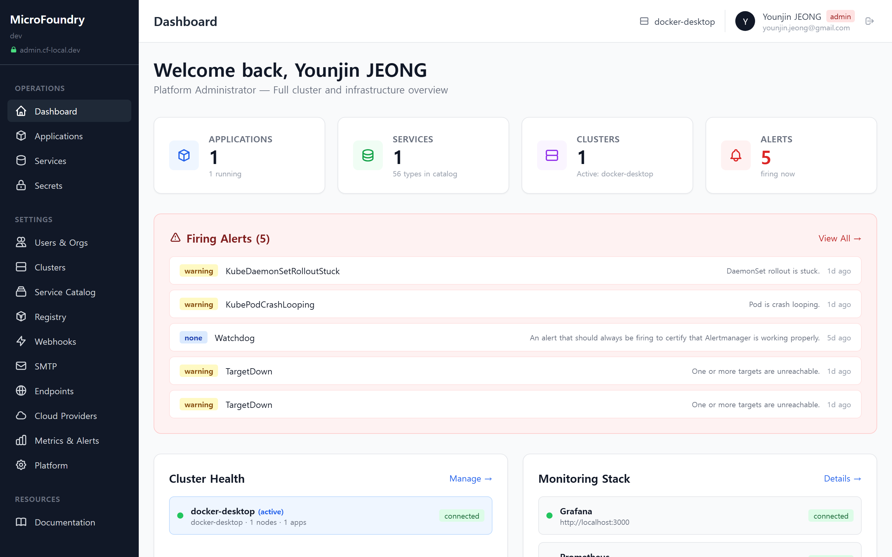 | 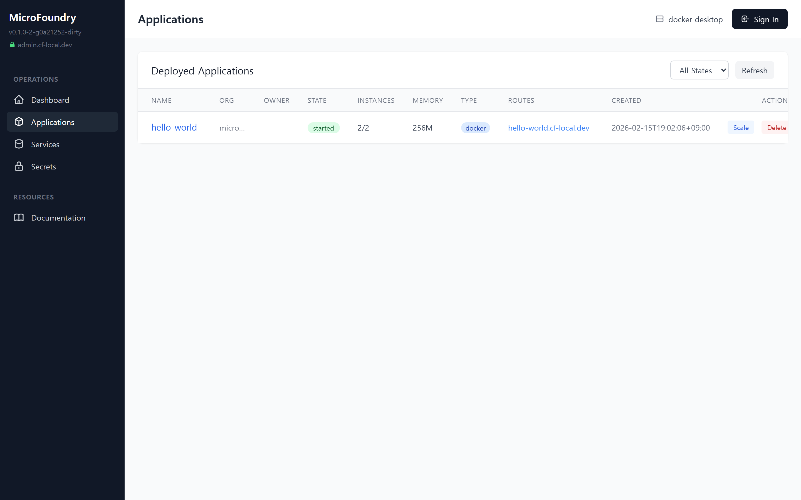 | 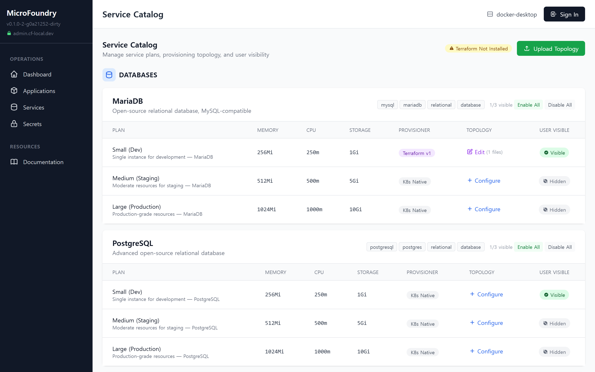 |
| Platform stats, quick links | App state, instances, routes | 10 service types, 3 plans each |

| Users & IAM | Workspaces | Clusters |
|:-----------:|:----------:|:--------:|
| 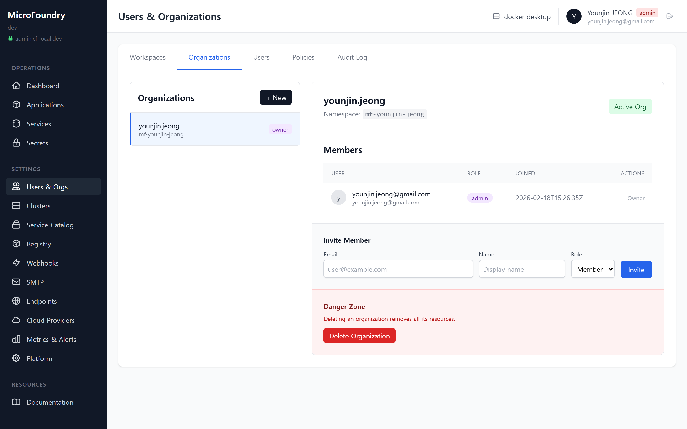 | 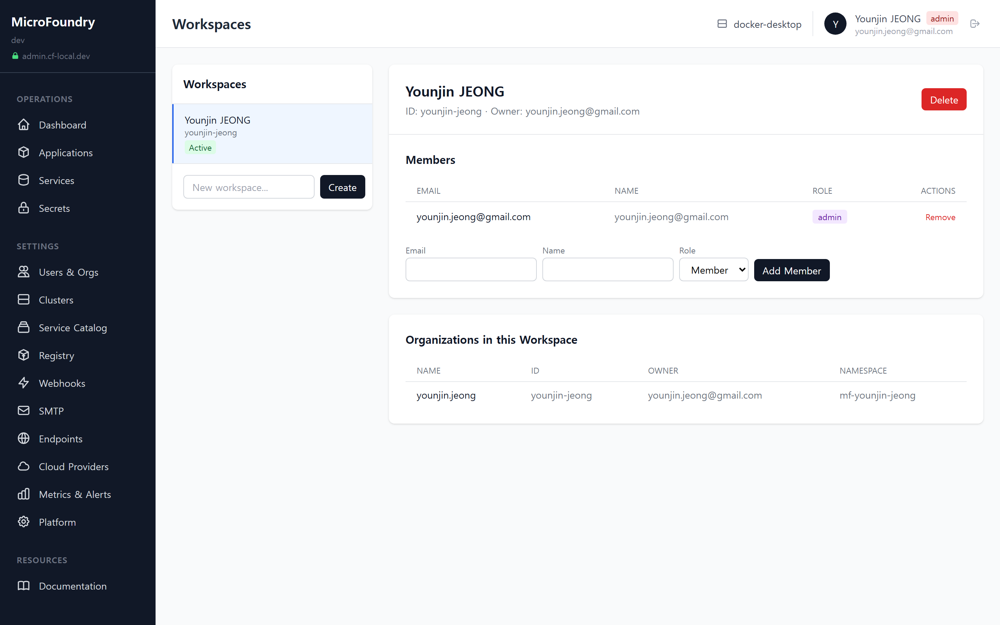 | 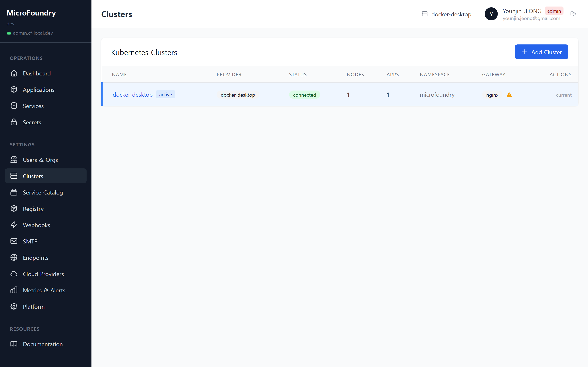 |
| Keycloak OIDC, OPA, SCIM v2 | Workspace hierarchy & RBAC | Multi-cluster management |

| Monitoring & Alerts | Services | Secrets |
|:-------------------:|:--------:|:-------:|
| 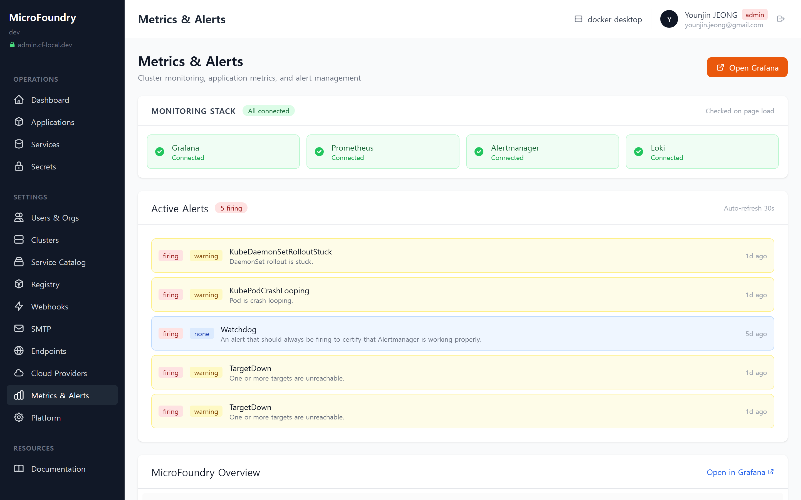 | 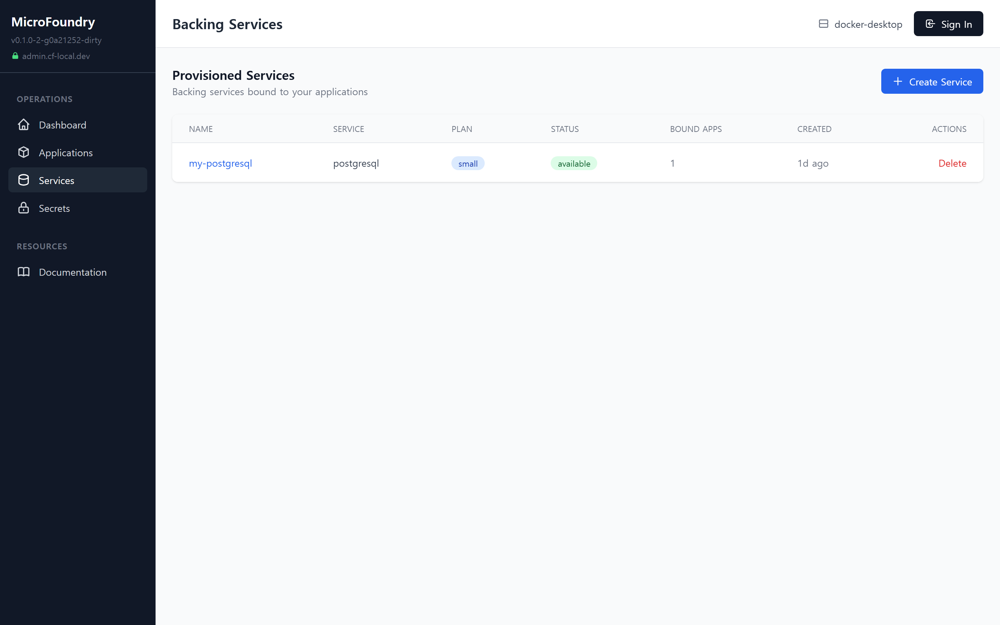 | 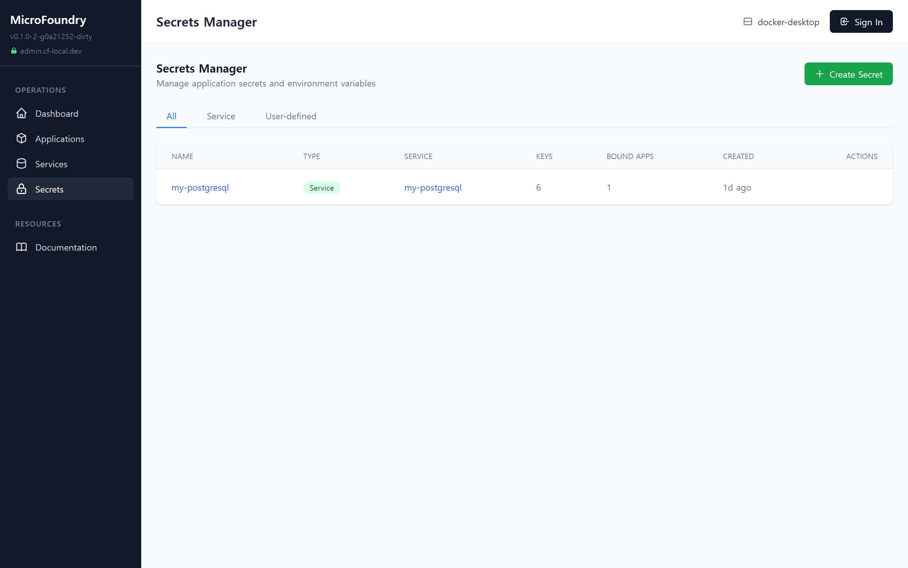 |
| Prometheus alerts, Grafana | Provisioned backing services | Service & user-defined secrets |

| Service Endpoints | Registry Settings | Platform Config |
|:-----------------:|:-----------------:|:---------------:|
| 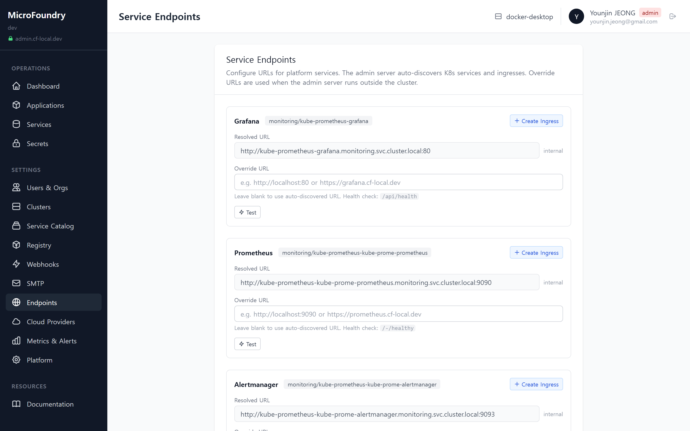 | 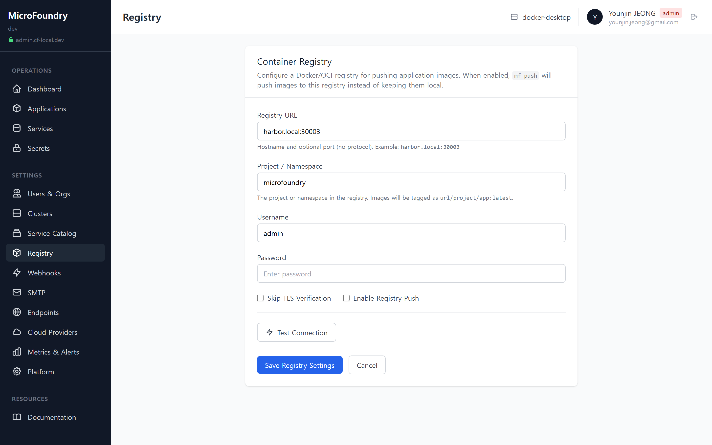 | 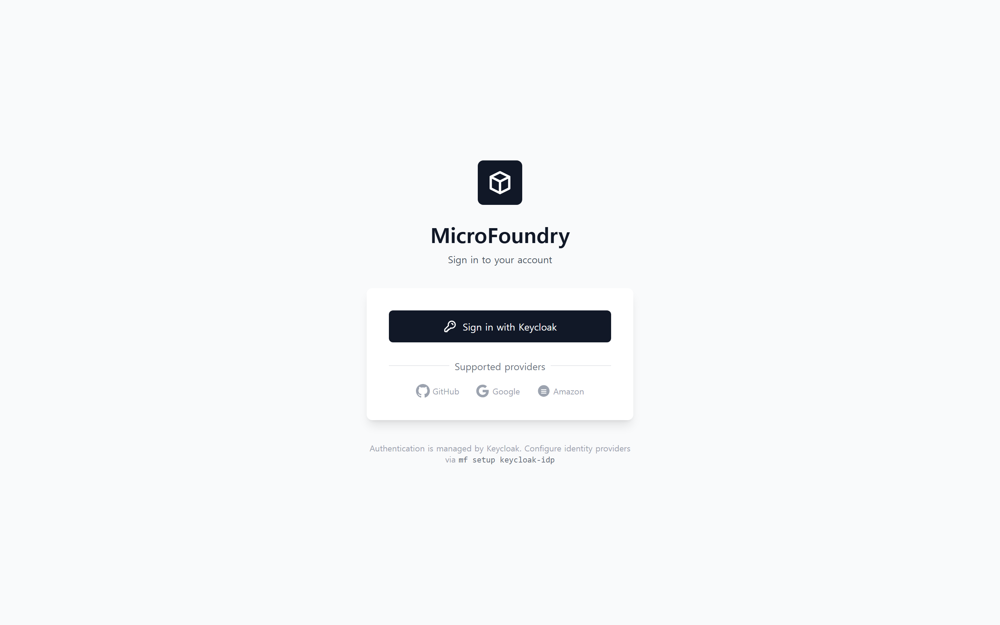 |
| Auto-discovery + override URLs | Container registry config | Domain, namespace, routing |

</details>

**Admin pages (super admin view):**

**Operations:**
- **Dashboard** — Platform stats (apps, domain, namespace, K8s context) with quick links
- **Applications** — Deploy, scale, delete apps with 8-tab detail view (Overview, Instances, Config, Services, Routes, Logs, Metrics, Performance)
- **Services** — Provisioned backing services with bind/unbind from app detail
- **Secrets** — Service secrets (auto-created) and user-defined key-value pairs with reveal toggle

**Settings (platform-admin only):**
- **Users & Orgs** — 5-tab IAM: Workspaces, Organizations, Users (Keycloak CRUD), OPA Policies, Audit Log
- **Clusters** — Register and switch between Docker Desktop, EKS, GKE, AKS clusters
- **Service Catalog** — Browse 10 service types by category with plan visibility and Terraform topology editor
- **Registry** — Container registry configuration (Harbor, ECR) with connection testing
- **Webhooks** — HTTP webhook configuration for platform events
- **SMTP** — Email notification server configuration
- **Endpoints** — Auto-discovered service URLs (Prometheus, Loki, Grafana, AlertManager) with override
- **Metrics & Alerts** — Prometheus alerts + embedded Grafana dashboards with Beyla eBPF auto-instrumentation
- **Platform** — Environment detection (docker-desktop/EKS/GKE/AKS), DNS configuration, TLS certificate details, ingress resources, and secrets-at-rest guidance
- **Documentation** — In-app docs viewer with categorized landing page, sidebar table of contents, reading time estimates, and 6 embedded markdown documents

---

## Architecture Overview

```
                          ┌─────────────────────────────────┐
                          │         Developer / AI          │
                          └──────────┬──────────┬───────────┘
                                     │          │
                              ┌──────▽──┐  ┌────▽──────┐
                              │  CLI    │  │  MCP      │
                              │ mf push │  │  Server   │
                              │ mf logs │  │ (Claude,  │
                              │ mf bind │  │  Cursor)  │
                              └──────┬──┘  └────┬──────┘
                                     │          │
                              ┌──────▽──────────▽──────┐
                              │  MicroFoundry API +    │
                              │  Admin Dashboard (:8080)│
                              └─────────────┬──────────┘
                                            │
          ┌─────────────────────────────────┼─────────────────────────────────┐
          │                                 │                                 │
  ┌───────▽────────┐              ┌─────────▽──────────┐            ┌────────▽────────┐
  │  Build System  │              │  Kubernetes API     │            │  Observability  │
  │                │              │                     │            │                 │
  │  Dockerfile    │              │  Deployments (Apps) │            │  Prometheus     │
  │  CNB/Paketo    │              │  Services (Network) │            │  Grafana        │
  │  pack CLI      │              │  Ingress (Routes)   │            │  Loki           │
  └────────────────┘              │  Secrets (Creds)    │            │  Beyla (eBPF)   │
                                  │  ConfigMaps         │            │  AlertManager   │
                                  └─────────┬──────────┘            └─────────────────┘
                                            │
                    ┌───────────────────────┼───────────────────────┐
                    │                       │                       │
            ┌───────▽───────┐       ┌───────▽───────┐      ┌───────▽───────┐
            │ API Gateway   │       │ Backing       │      │ IAM           │
            │ (Kong/Nginx/  │       │ Services      │      │ Keycloak OIDC │
            │  AWS API GW)  │       │ (DB/Cache/MQ) │      │ OPA + SCIM v2 │
            └───────────────┘       └───────────────┘      └───────────────┘
```

### Multi-Cluster Runtime

```
┌─────────────────────────────────────────────────────────────────────┐
│                     MicroFoundry Control Plane                      │
│                                                                     │
│  ┌───────────────┐  ┌──────────────┐  ┌──────────────┐            │
│  │  Config Store  │  │  Cluster     │  │  Service     │            │
│  │  (mf.yaml +   │  │  Manager     │  │  Catalog     │            │
│  │   K8s ConfigMap)│  │              │  │              │            │
│  └───────┬───────┘  └──────┬───────┘  └──────┬───────┘            │
└──────────┼─────────────────┼─────────────────┼─────────────────────┘
           │                 │                 │
    ┌──────▽──────┐   ┌──────▽──────┐   ┌──────▽──────┐
    │ Docker      │   │ AWS EKS     │   │ GCP GKE     │
    │ Desktop     │   │             │   │             │
    │ cf-local.dev│   │ *.app.com   │   │ *.app.io    │
    └─────────────┘   └─────────────┘   └─────────────┘
```

---

## CloudFoundry Mapping

| CF Component | MicroFoundry Equivalent | Implementation |
|---|---|---|
| **Diego Cell** | Kubernetes Pod | K8s Deployment + Service + Ingress |
| **Gorouter** | API Gateway (Kong / Nginx / AWS API GW) | Pluggable ingress controller |
| **Cloud Controller** | MicroFoundry API Server (Go) | Lightweight API → K8s API directly |
| **Buildpacks** | Cloud Native Buildpacks (CNB/Paketo) | Source-to-container without Dockerfile |
| **Service Broker** | Built-in K8s-native Broker | 10 service types with real K8s provisioning |
| **Service Catalog** | Built-in Catalog (10 services) | MariaDB, PostgreSQL, Redis, RabbitMQ, MinIO, Kong, etc. |
| **Loggregator** | Promtail + Loki | Log collection per pod → Loki aggregation |
| **Doppler/Metrics** | Prometheus + Grafana + Beyla eBPF | Auto-instrumented RED metrics |
| **NATS (Alerts)** | AlertManager | Prometheus alerting rules + AlertManager |
| **Config Server** | K8s Secrets + ConfigMaps | VCAP_SERVICES injection + platform settings |
| **UAA** | Keycloak OIDC + OPA + SCIM v2 | OIDC auth, Rego policies, standard provisioning |
| **CF CLI** | `mf` CLI (Cobra) | 20+ commands mirroring CF CLI |
| **— (new)** | MCP Server | AI tool integration via Model Context Protocol |

### CloudFoundry vs MicroFoundry at a Glance

| Metric | Cloud Foundry | MicroFoundry |
|--------|--------------|--------------|
| **Deployment** | 40-80+ BOSH-managed VMs | 1 container on any K8s cluster |
| **Languages** | Ruby, Go, Java | Go only |
| **Components** | 12+ distinct systems (Diego, CC, UAA, Gorouter, NATS, Loggregator...) | 1 binary, 21 Go packages |
| **Install time** | Hours (BOSH deploy) | Minutes (Helm install) |
| **State storage** | PostgreSQL/MySQL (8 databases) | Kubernetes objects (ConfigMaps, Secrets) |
| **Monitoring** | Requires external nozzle integration | Integrated (Prometheus/Grafana/Loki/Beyla eBPF) |
| **Admin UI** | Apps Manager (commercial, Tanzu only) | Built-in open-source dashboard (47 templates) |
| **Authorization** | Hardcoded roles in Ruby CC | OPA Rego policies (editable at runtime) |
| **Cloud providers** | BOSH CPI per IaaS | Terraform modules (AWS EKS, ECS Fargate, GCP GKE, Azure AKS) |

> **~80% of Cloud Foundry's developer experience with ~1% of the operational complexity.**

For the full architectural comparison covering all 10 component areas, CLI parity, deployment models, and design trade-offs, see [CloudFoundry vs MicroFoundry](docs/cloudfoundry-vs-microfoundry.md).

---

## Developer Experience

### CLI Commands

| Command | CF Equivalent | Description |
|---|---|---|
| `mf push [app]` | `cf push` | Build + deploy from source (Dockerfile or CNB) |
| `mf apps` | `cf apps` | List deployed applications with status |
| `mf app [name]` | `cf app` | Show app details and instance list |
| `mf logs [app]` | `cf logs` | Stream or fetch application logs |
| `mf scale [app] -i N` | `cf scale` | Scale application instances |
| `mf delete [app]` | `cf delete` | Delete app and clean up routes |
| `mf catalog` | `cf marketplace` | List available services by category |
| `mf create-service <type> <plan> <name>` | `cf create-service` | Provision a backing service |
| `mf services` | `cf services` | List provisioned service instances |
| `mf bind-service <app> <svc>` | `cf bind-service` | Bind service → inject VCAP_SERVICES |
| `mf unbind-service <app> <svc>` | `cf unbind-service` | Unbind service from app |
| `mf delete-service <name>` | `cf delete-service` | Delete service instance |
| `mf secrets` | — | List managed secrets |
| `mf create-secret <name> k=v...` | — | Create user-defined secret |
| `mf delete-secret <name>` | — | Delete a secret |
| `mf admin` | — | Start web dashboard (:8443 with TLS, :8080 without) |
| `mf setup keycloak` | — | Deploy Keycloak for authentication |
| `mf setup keycloak-realm` | — | Configure Keycloak realm and client |
| `mf setup keycloak-idp` | — | Add identity provider (Google, GitHub, Amazon) |
| `mf users` | — | List Keycloak users |
| `mf create-user <email>` | — | Create a new user |
| `mf orgs` | — | List organizations |
| `mf create-org <name>` | — | Create an organization |
| `mf auth login` | — | Authenticate via OIDC |
| `mf version` | — | Print version |

### MCP Server Tools

| MCP Tool | Description |
|---|---|
| `mf_push` | Deploy an application from source |
| `mf_logs` | Stream or fetch application logs |
| `mf_bind_service` | Bind a backing service to an app |
| `mf_create_service` | Provision a backing service instance |
| `mf_routes` | List or manage application routes |
| `mf_scale` | Scale app instances or resources |
| `mf_env` | View or set environment variables |
| `mf_apps` | List deployed applications |
| `mf_delete` | Remove a deployed application |

---

## Platform Capabilities

### Application Lifecycle

```bash
$ mf push hello-world
Building image...         [Dockerfile detected]
Deploying to K8s...       [deployment/hello-world created]
Creating ingress route... [hello-world.cf-local.dev → :8080]
Updating hosts file...    [127.0.0.1 hello-world.cf-local.dev]
Waiting for rollout...    [3/3 instances running]

   app:        hello-world
   url:        http://hello-world.cf-local.dev
   instances:  3/3 running
   memory:     256M
   metrics:    auto-instrumented (Beyla eBPF)
   dashboard:  http://localhost:8080/apps/hello-world?tab=performance
```

### Service Broker & Catalog

```
┌─────────────────────────────────────────────────────────────┐
│                    Service Catalog                           │
├──────────────┬──────────────┬───────────────┬───────────────┤
│  Databases   │  Caches      │  Messaging    │  Storage/GW   │
├──────────────┼──────────────┼───────────────┼───────────────┤
│  MariaDB     │  Redis       │  RabbitMQ     │  MinIO (S3)   │
│  PostgreSQL  │  Memcached   │  ActiveMQ     │  Kong          │
│  ClickHouse  │              │               │  Nginx         │
└──────────────┴──────────────┴───────────────┴───────────────┘
  Each with 3 plans: small (dev) / medium (staging) / large (prod)
```

```bash
$ mf catalog
$ mf create-service postgresql small my-db
$ mf bind-service hello-world my-db    # Injects VCAP_SERVICES
```

### Observability Stack

```
┌──────────────────────────────────────────────────────────────────┐
│  Observability Stack                                              │
│                                                                   │
│  ┌──────────┐    eBPF     ┌────────────┐   scrape  ┌──────────┐ │
│  │  App Pod  │◀───────────│  Beyla      │──────────▶│Prometheus│ │
│  │ (any lang)│  zero-code │  DaemonSet  │           │          │ │
│  └──────────┘  intercept  └────────────┘           └────┬─────┘ │
│       │                                                  │       │
│       │ stdout/stderr      ┌────────────┐         ┌─────▽─────┐ │
│       └───────────────────▶│  Promtail  │────────▶│  Grafana  │ │
│                            └────────────┘         │  + Loki   │ │
│                                                   └─────┬─────┘ │
│  Pre-computed RED Metrics:                              │       │
│    microfoundry:http_request_rate:5m               ┌────▽──────┐│
│    microfoundry:http_error_rate:5m                 │AlertManager││
│    microfoundry:http_latency_p50/p95/p99:5m        └───────────┘│
└──────────────────────────────────────────────────────────────────┘
```

### Authentication & Authorization

```bash
mf setup keycloak                # Deploy Keycloak to cluster
mf setup keycloak-realm          # Configure realm, client, roles
mf setup keycloak-idp \          # Add social login
  --provider google \
  --client-id <ID> --client-secret <SECRET>
```

- **OIDC Authorization Code Flow** with PKCE
- **Social login**: Google, GitHub, Amazon identity providers
- **5-tier RBAC**: platform-admin → workspace-admin → org-admin → member → viewer
- **Workspace hierarchy**: Platform → Workspace → Organization for multi-tenant isolation
- **Organizations**: Multi-tenant org management with member invitations
- **OPA Authorization**: Embedded Open Policy Agent with Rego policies
- **SCIM v2**: Standard identity provisioning endpoints (RFC 7643/7644)
- **Audit Log**: In-memory ring buffer with resource/action/decision tracking
- **Role-based UI**: Sidebar adapts to user role — platform-admins see Settings, members see Operations only

---

## Getting Started

### Prerequisites

- Go 1.25+
- Docker Desktop with Kubernetes enabled
- kubectl
- Helm 3

### Build & Install

```bash
make build              # Build to bin/mf
make install            # Install to GOPATH/bin
make hooks              # Install pre-commit hooks (gitleaks secret detection)
```

### Deploy Monitoring Stack

```bash
make monitoring-install  # Prometheus + Grafana + Loki + Beyla
```

### Deploy Your First App

```bash
mf push hello-world                          # Deploy from source
mf create-service postgresql small my-db     # Provision a database
mf bind-service hello-world my-db            # Bind DB → app
mf logs hello-world                          # Stream logs
mf admin                                     # Open web dashboard
```

### Set Up Authentication (Optional)

```bash
mf setup keycloak                            # Deploy Keycloak
kubectl port-forward -n microfoundry svc/keycloak 8180:8180
mf setup keycloak-realm --url http://localhost:8180
# Add auth section to configs/mf.yaml, then restart mf admin
```

### Configuration

```bash
cp configs/mf.example.yaml configs/mf.yaml
```

```yaml
kubernetes:
  active: "docker-desktop"
  clusters:
    docker-desktop:
      context: "docker-desktop"
      namespace: "microfoundry"
      domain: "cf-local.dev"
      provider: "docker-desktop"
    eks-prod:
      context: "arn:aws:eks:us-west-2:..."
      namespace: "microfoundry"
      domain: "apps.example.com"
      provider: "eks"
```

---

## Tech Stack

| Layer | Technology | Purpose |
|---|---|---|
| **Language** | Go 1.25 | API server, CLI, MCP server, all controllers |
| **CLI** | Cobra + Viper | Command parsing + configuration |
| **Runtime** | Kubernetes | Application scheduling and orchestration |
| **Build** | Cloud Native Buildpacks (Paketo) | Source-to-container builds |
| **Ingress** | Kong / Nginx / Traefik / AWS API GW | Pluggable API gateway with WebSocket/gRPC support |
| **TLS** | mkcert | Local .dev HTTPS with auto-generated certificates |
| **Metrics** | Prometheus + Grafana | Collection and visualization |
| **Logs** | Promtail + Loki | Aggregation and querying |
| **Auto-Instrumentation** | Grafana Beyla (eBPF) | Zero-code HTTP metrics |
| **Alerting** | AlertManager | Alert routing and notification |
| **Authentication** | Keycloak + go-oidc | OIDC authorization code flow |
| **Authorization** | Open Policy Agent (OPA) | Rego-based policy evaluation |
| **Provisioning** | SCIM v2 | Standard identity provisioning |
| **Sessions** | gorilla/sessions | Cookie-based session management |
| **UI** | Go templates + HTMX + Tailwind CSS | Server-side rendering, no JS build step |
| **IaC** | Terraform | Cloud resource topology management |
| **AI** | Model Context Protocol (MCP) | AI tool platform access |
| **K8s Client** | client-go | Kubernetes API interactions |
| **Security** | gitleaks + pre-commit | Secret detection and commit-time security scanning |
| **Docs Rendering** | goldmark | In-app markdown rendering with auto heading IDs |

---

## Project Structure

```
microfoundry/
├── cmd/mf/                    # CLI entry points (25+ commands)
│   ├── main.go                #   root command + version
│   ├── push.go                #   mf push (build → registry → deploy → ingress → hosts)
│   ├── apps.go                #   mf apps / mf app
│   ├── logs.go                #   mf logs (stream + history)
│   ├── scale.go               #   mf scale
│   ├── delete.go              #   mf delete
│   ├── catalog.go             #   mf catalog (marketplace)
│   ├── create_service.go      #   mf create-service
│   ├── services.go            #   mf services / mf service
│   ├── bind_service.go        #   mf bind-service
│   ├── unbind_service.go      #   mf unbind-service
│   ├── delete_service.go      #   mf delete-service
│   ├── secrets.go             #   mf secrets / mf create-secret / mf delete-secret
│   ├── users.go               #   mf users / mf create-user (Keycloak user management)
│   ├── orgs.go                #   mf orgs / mf create-org (organization management)
│   ├── auth.go                #   mf auth login (OIDC authentication)
│   ├── admin.go               #   mf admin (web dashboard + auth + OPA init + TLS)
│   └── setup.go               #   mf setup keycloak / keycloak-realm / keycloak-idp
│
├── pkg/                       # Go packages
│   ├── admin/                 #   Web dashboard + API handlers (100+ routes)
│   │   ├── server.go          #     HTTP server, route registration, auth/OPA middleware
│   │   ├── handlers.go        #     App detail, dashboard, tab routing
│   │   ├── api.go             #     JSON API endpoints
│   │   ├── scim_handlers.go   #     SCIM v2 endpoints (RFC 7643/7644)
│   │   ├── iam_handlers.go    #     IAM tab + Keycloak user management
│   │   ├── org_handlers.go    #     Organization + member management
│   │   ├── performance_handlers.go  # RED metrics + observability
│   │   ├── service_handlers.go      # Service management UI
│   │   ├── cluster_handlers.go      # Multi-cluster management
│   │   ├── monitoring_handlers.go   # Alert & monitoring UI
│   │   ├── secret_handlers.go       # Secret management UI
│   │   ├── workspace_handlers.go    # Workspace hierarchy management
│   │   ├── settings_handlers.go     # Registry, webhooks, SMTP, endpoints config
│   │   ├── topology_handlers.go     # Terraform topology editor
│   │   ├── logs.go            #     SSE log streaming
│   │   ├── templates.go       #     Template renderer (clone pattern)
│   │   └── static/            #     Embedded HTML/CSS/JS templates
│   │       ├── templates/     #       25+ page templates
│   │       │   ├── partials/  #       Shared partials (nav, header)
│   │       │   └── tabs/      #       HTMX tab partials (13 tabs)
│   │       └── css/           #       Tailwind CSS
│   ├── auth/                  #   Authentication & Authorization
│   │   ├── oidc.go            #     OIDC authorization code flow with PKCE
│   │   ├── session.go         #     Cookie-based session management
│   │   ├── keycloak.go        #     Realm/client/IdP setup
│   │   ├── keycloak_admin.go  #     Keycloak Admin REST API client (user CRUD)
│   │   ├── scim.go            #     SCIM v2 types + Keycloak conversion
│   │   ├── opa.go             #     Embedded OPA engine (Rego evaluation)
│   │   ├── opa_middleware.go  #     OPA HTTP middleware + route classification
│   │   ├── audit.go           #     Authorization audit log (ring buffer)
│   │   ├── org.go             #     Organization & member management
│   │   ├── workspace.go       #     Workspace hierarchy & RBAC
│   │   ├── middleware.go      #     InjectUser middleware
│   │   ├── config.go          #     Auth configuration types
│   │   └── policies/          #     Embedded Rego policies
│   │       └── authz.rego     #       Default authorization policy
│   ├── build/                 #   Source-to-image (Dockerfile + CNB + registry push)
│   ├── config/                #   Multi-cluster configuration (Viper + YAML)
│   ├── hosts/                 #   /etc/hosts management
│   ├── tls/                   #   mkcert TLS certificate generation
│   ├── k8s/                   #   Kubernetes client + operations
│   │   ├── client.go          #     K8s API client wrapper
│   │   ├── app.go             #     Deployment/Service/Pod management
│   │   ├── ingress.go         #     Ingress route management
│   │   ├── manager.go         #     Multi-cluster ClientManager
│   │   ├── registry.go        #     imagePullSecret management
│   │   └── keycloak.go        #     Keycloak K8s deployment
│   ├── manifest/              #   CF manifest.yml parser
│   ├── models/                #   Core data models
│   ├── monitoring/            #   Observability stack integration
│   │   ├── prometheus.go      #     Prometheus query client (RED metrics)
│   │   ├── grafana.go         #     Grafana dashboard URL builder
│   │   ├── loki.go            #     Log aggregation client
│   │   ├── alertmanager.go    #     Alert management client
│   │   ├── metrics.go         #     Custom Prometheus metrics
│   │   ├── collector.go       #     Background metrics collection (30s)
│   │   └── middleware.go      #     HTTP metrics middleware
│   ├── secrets/               #   K8s Secret management
│   ├── service/               #   Service broker + catalog + provisioning
│   │   ├── catalog.go         #     10 service types, 3 plans each
│   │   ├── provisioner.go     #     K8s-native provisioning (StatefulSet, PVC)
│   │   ├── binder.go          #     VCAP_SERVICES injection
│   │   └── visibility.go      #     Plan visibility toggle
│   ├── settings/              #   Platform settings (ConfigMap/Secret store)
│   └── terraform/             #   Terraform topology management
│
├── deploy/
│   ├── k8s/                   # Kubernetes manifests
│   │   ├── base/              #   Base manifests (namespace)
│   │   └── overlays/          #   Kustomize overlays (local, EKS, GKE, AKS)
│   ├── monitoring/            # Observability stack
│   │   ├── install.sh         #   One-command monitoring setup
│   │   ├── beyla-config.yaml  #   Beyla eBPF DaemonSet
│   │   ├── prometheus-recording-rules.yaml
│   │   ├── dashboards/        #   Grafana dashboards
│   │   └── alerts/            #   Prometheus alerting rules
│   ├── helm/                  # Helm chart (OCI artifact)
│   └── csp/                   # Cloud deployment packages
│       ├── aws-eks/           #   AWS EKS (VPC, EKS, ECR, ALB, CloudWatch)
│       ├── aws-ecs-fargate/   #   AWS ECS Fargate + EKS worker
│       ├── gcp-gke/           #   GCP GKE Autopilot/Standard
│       ├── azure-aks/         #   Azure AKS (VNet, ACR, AGIC)
│       └── local-k8s/         #   Local K8s (nginx ingress, self-hosted monitoring)
│
├── test/                      # E2E tests (Playwright)
│   ├── playwright.config.ts   #   Test configuration
│   ├── screenshots.ts         #   Screenshot & walkthrough capture (super admin)
│   ├── e2e/                   #   82 test cases across 12 suites
│   └── helpers/               #   Test utilities
│
├── configs/mf.example.yaml   # Example configuration
├── docs/                      # Documentation (embedded in admin UI via embed.FS)
│   ├── embed.go               #   go:embed directive for in-app docs viewer
│   ├── user-manual.md         #   Complete user guide
│   ├── architecture.md        #   Technical architecture
│   ├── admin-guide.md         #   Admin dashboard guide
│   ├── cloudfoundry-vs-microfoundry.md  # CF vs MF comparison
│   ├── cloudfoundry-architecture.md  # CF reference architecture
│   └── observability-capacity.md     # Monitoring & capacity planning
├── Makefile                   # Build targets
├── Dockerfile                 # Container build
├── CLAUDE.md                  # Agent workflow rules
├── .gitleaks.toml             # Gitleaks secret detection config
├── .pre-commit-config.yaml    # Pre-commit hooks (gitleaks, linting)
└── LICENSE
```

---

## Documentation

All documentation is available both as markdown files and through the **in-app docs viewer** at `/docs` in the admin dashboard — with categorized landing page, sidebar table of contents, reading time, and word count.

| Document | Description |
|----------|-------------|
| [User Manual](docs/user-manual.md) | Complete guide to deploying and managing applications |
| [Architecture](docs/architecture.md) | Technical architecture and component design |
| [Admin Guide](docs/admin-guide.md) | Admin dashboard pages, API reference (100+ endpoints) |
| [CF vs MF Comparison](docs/cloudfoundry-vs-microfoundry.md) | Side-by-side architectural comparison across 10 component areas |
| [CF Architecture](docs/cloudfoundry-architecture.md) | CloudFoundry reference architecture |
| [Observability & Capacity](docs/observability-capacity.md) | Monitoring stack and capacity planning |

---

## How We Build: Human-AI Collaborative Development

MicroFoundry is developed through a structured **Human-AI pair programming workflow** using [Claude Code](https://claude.ai/claude-code) (Anthropic's AI coding agent). This isn't casual AI assistance — it's a formalized development process where AI participates in every phase of the software development lifecycle.

### The Workflow

```
┌────────────────────────────────────────────────────────────────────┐
│                    Epic Development Lifecycle                       │
│                                                                    │
│  ┌──────────┐    ┌──────────┐    ┌──────────┐    ┌──────────┐    │
│  │ Analyzer  │───▶│  Issue   │───▶│  Agent   │───▶│   Plan   │    │
│  │  Check   │    │ Creation │    │Discussion│    │  Review  │    │
│  └──────────┘    └──────────┘    └──────────┘    └──────────┘    │
│       │                                                │          │
│       │  ┌──────────────────────────────────────────────┘          │
│       │  │                                                        │
│  ┌────▽──▽───┐    ┌──────────┐    ┌──────────┐    ┌──────────┐  │
│  │   Code    │───▶│    PR    │───▶│  Agent   │───▶│  Merge   │  │
│  │  Implement│    │ Creation │    │  Review  │    │  to rc   │  │
│  └───────────┘    └──────────┘    └──────────┘    └──────────┘  │
│                                                                    │
└────────────────────────────────────────────────────────────────────┘
```

**Each Epic follows this process:**

1. **Analyzer Check** — Verify no open PR dependencies; ensure `rc` branch is clean
2. **Issue Creation** — Create a GitHub issue with full Epic scope, architecture decisions, and file plan
3. **Agent Discussion** — 7 specialized agents comment on the issue with their domain expertise
4. **Plan Review** — Human reviews agent feedback and approves the implementation plan
5. **Implementation** — Claude Code implements all code changes (typically 10-25 files per Epic)
6. **PR Creation** — Create a pull request targeting the `rc` branch
7. **Agent Review** — All 7 agents post review comments on the PR with findings and recommendations
8. **Merge** — Human reviews and merges to `rc`

### The 7+1 Agent Personas

Every issue and PR receives comments from **7 specialized review agents**. Additionally, a **Document Expert** agent runs periodically to keep docs in sync.

#### Per-Epic Review Agents (every Epic)

| Agent | Role | Focus Area |
|-------|------|------------|
| **Security Architect** | Identifies vulnerabilities, auth gaps, injection risks | OWASP, authentication flows, secrets management, policy bypass |
| **Platform Engineer** | Reviews reliability, performance, crash safety | Nil guards, error handling, middleware ordering, resource leaks |
| **API Designer** | Ensures API consistency, spec compliance, contracts | REST conventions, SCIM RFC compliance, pagination, error schemas |
| **Frontend Engineer** | Reviews UI/UX, template patterns, accessibility | HTMX interactions, Tailwind consistency, error states, responsive design |
| **DevOps Engineer** | Evaluates deployment safety, observability, CI/CD | Rolling updates, log formats, monitoring integration, build pipeline |
| **QA Engineer** | Designs test plans, verification matrices, regression checks | Unit/integration/manual test cases, edge cases, acceptance criteria |
| **Product Manager** | Assesses scope, user impact, prioritization | User stories, release blocking decisions, success metrics, communication |

#### Periodic Batch Agent (every 5 Epics)

| Agent               | Role                                         | Focus Area                                                             |
|---------------------|----------------------------------------------|------------------------------------------------------------------------|
| **Document Expert** | Syncs README and docs/ with codebase reality | CLI commands, API endpoints, config changes, admin pages, architecture |

The Document Expert activates after every 5th merged Epic. It audits all changes since the last sync, classifies their documentation impact (Critical → None), updates README.md and all 5 docs files, then creates a docs-only PR. This ensures documentation never drifts more than 5 Epics behind the actual codebase. Full workflow spec: [`.github/agents/doc-expert.md`](.github/agents/doc-expert.md).

### Branch Strategy: Release-Candidate Flow

We use a **three-tier branching model** designed for structured integration and safe promotion:

```
main (stable release — production-ready)
  └── rc (release-candidate — integration & validation)
        ├── epic/feature-a  →  PR targets rc
        ├── epic/feature-b  →  PR targets rc
        └── epic/feature-c  →  PR targets rc
```

| Branch | Purpose | Merges From | Merges To |
|--------|---------|-------------|-----------|
| **`main`** | Stable release. Always deployable. Tagged for releases. | `rc` only | — |
| **`rc`** | Integration branch. All Epics land here first. Validated before promoting to `main`. | `epic/*` branches | `main` |
| **`epic/*`** | Feature branches. One per Epic. Created from `rc`, never from `main` or another epic. | — | `rc` |

**Key rules:**

1. **All PRs target `rc`**, never `main` directly
2. **Epic branches are independent** — never stack PRs by merging one epic into another
3. **Analyzer checks dependencies** — before starting a new Epic, verify no open PRs conflict
4. **`rc` → `main` promotion** happens when a set of features is validated (build passes, agents reviewed, human approved)
5. **Fast-forward merges preferred** for `rc` → `main` to keep clean history

**Typical flow:**

```
git checkout rc && git pull origin rc
git checkout -b epic/new-feature        # Branch from rc
# ... implement ...
gh pr create --base rc                  # PR targets rc
# ... agent review + human merge ...
# When ready to release:
git checkout main && git merge rc       # Promote to main
```

### Why This Workflow?

This structured process serves several purposes:

- **Quality through diverse perspectives** — Each agent catches issues specific to their domain. Security finds auth bypasses, QA designs test matrices, DevOps flags deployment risks — simultaneously.
- **Documented decision trail** — Every architectural decision, trade-off, and review finding is captured in GitHub issues and PR comments, creating a permanent knowledge base.
- **Consistent velocity** — Epics averaging 15-25 files are implemented, reviewed, and merged in single sessions with comprehensive coverage.
- **Human oversight** — The human developer ([@younjinjeong](https://github.com/younjinjeong)) reviews all agent feedback, approves plans, and makes final merge decisions. AI proposes; human disposes.

---

## Development History

MicroFoundry has been built incrementally through a series of Epics, each adding a major capability:

| PR | Epic | Description | Files |
|----|------|-------------|-------|
| [#2](https://github.com/younjinjeong/microfoundry/pull/2) | Local K8s Runtime | `mf push`, `mf apps`, `mf logs`, `mf scale`, `mf delete` — core CLI | — |
| [#4](https://github.com/younjinjeong/microfoundry/pull/4) | Admin Dashboard | Web admin interface with HTMX, dashboard, app management | — |
| [#6](https://github.com/younjinjeong/microfoundry/pull/6) | App Detail View | 8-tab application detail view (Overview → Performance) | — |
| [#8](https://github.com/younjinjeong/microfoundry/pull/8) | Multi-Cluster | Multi-cluster Kubernetes management with ClientManager | — |
| [#10](https://github.com/younjinjeong/microfoundry/pull/10) | Backing Services | Service catalog, provisioning, binding, VCAP_SERVICES | — |
| [#11](https://github.com/younjinjeong/microfoundry/pull/11) | Real K8s Provisioning | StatefulSet + PVC provisioning for all 10 service types | — |
| [#13](https://github.com/younjinjeong/microfoundry/pull/13) | Terraform Topologies | Terraform-based service topology management | — |
| [#15](https://github.com/younjinjeong/microfoundry/pull/15) | Catalog & Visibility | Service catalog browser with plan visibility controls | — |
| [#17](https://github.com/younjinjeong/microfoundry/pull/17) | Monitoring & Logging | Prometheus + Loki + Grafana + AlertManager integration | — |
| [#20](https://github.com/younjinjeong/microfoundry/pull/20) | Beyla eBPF | Netflix Atlas-inspired auto-instrumentation with Beyla | — |
| [#22](https://github.com/younjinjeong/microfoundry/pull/22) | Observability Hardening | Security, resilience & capacity for monitoring stack | — |
| [#24](https://github.com/younjinjeong/microfoundry/pull/24) | Platform Config | Registry, webhooks, SMTP settings via admin UI | — |
| [#26](https://github.com/younjinjeong/microfoundry/pull/26) | Keycloak UAA | OIDC authentication with Keycloak, sessions, org management | — |
| [#31](https://github.com/younjinjeong/microfoundry/pull/31) | E2E Testing | Playwright E2E test suite (82 test cases, 8 suites) | — |
| [#34](https://github.com/younjinjeong/microfoundry/pull/34) | IAM & SCIM | Keycloak user CRUD, SCIM v2, OPA authorization, audit log | 22 |
| [#37](https://github.com/younjinjeong/microfoundry/pull/37) | IAM Hardening | Authz bypass fix, error handling, SCIM compliance, OPA atomicity | 7 |
| [#40](https://github.com/younjinjeong/microfoundry/pull/40) | Docs Sync #3 | Documentation sync for IAM, SCIM v2, OPA & Audit | — |
| [#42](https://github.com/younjinjeong/microfoundry/pull/42) | Local TLS | mkcert TLS for `.dev` HTTPS access | — |
| [#44](https://github.com/younjinjeong/microfoundry/pull/44) | Contextual Tooltips | Tooltips across all admin UI pages | — |
| [#46](https://github.com/younjinjeong/microfoundry/pull/46) | Admin Domain | Configurable domain name with auto-TLS | — |
| [#48](https://github.com/younjinjeong/microfoundry/pull/48) | Pluggable Gateway | nginx/kong/traefik/AWS API Gateway support | — |
| [#50](https://github.com/younjinjeong/microfoundry/pull/50) | Protocol Support | WebSocket and gRPC protocol support for routes | — |
| [#54](https://github.com/younjinjeong/microfoundry/pull/54) | Service Creation UI | Service creation form + bind/unbind UI | — |
| [#58](https://github.com/younjinjeong/microfoundry/pull/58) | User/Org CLI | User and organization management CLI commands | — |
| [#61](https://github.com/younjinjeong/microfoundry/pull/61) | Service Endpoints | Configurable service endpoints with K8s auto-discovery | — |
| [#64](https://github.com/younjinjeong/microfoundry/pull/64) | Workspace RBAC | Workspace hierarchy, 5-tier RBAC, CLI auth | — |
| [#65](https://github.com/younjinjeong/microfoundry/pull/65) | Workspace IAM Tab | Workspaces tab in Users & Organizations page | — |
| — | Release & CSP | GoReleaser workflow, 5 cloud deployment packages (AWS EKS, ECS Fargate, GCP GKE, Azure AKS, local K8s) | — |
| — | Platform Settings | Platform settings page (DNS, TLS, environment detection, ingress), security pre-commit hooks | — |
| — | Docs Redesign | In-app docs viewer with landing page, sidebar TOC, reading time, 6 embedded documents | — |

### External Contributions

| PR | Author | Description |
|----|--------|-------------|
| [#29](https://github.com/younjinjeong/microfoundry/pull/29) | [@byunjuneseok](https://github.com/byunjuneseok) | Fix: add EnsureNamespace to create-service command |

### Release

| Version | Tag | Description |
|---------|-----|-------------|
| **v0.1.0** | [`v0.1.0`](https://github.com/younjinjeong/microfoundry/releases/tag/v0.1.0) | First release — GoReleaser cross-compilation, multi-arch Docker images, Helm OCI chart, 5 cloud deployment packages |

---

## Contributing

Contributions are welcome! Here's how the project operates:

### For Human Contributors

1. Fork the repository
2. Create a feature branch from `rc` (not `main`)
3. Make your changes
4. Submit a PR targeting `rc`
5. The maintainer will review with agent assistance

### For AI-Assisted Development

This project uses Claude Code with a defined workflow in [CLAUDE.md](CLAUDE.md). If you're experimenting with AI-assisted development:

1. The agent workflow rules in `CLAUDE.md` define branch strategy and conventions
2. Each Epic follows the Analyzer → Issue → Discussion → Plan → Implement → PR → Review cycle
3. 7 agent personas provide structured feedback on issues and PRs
4. All changes must pass `go build ./...` and `go vet ./...`

### Build & Verify

```bash
make hooks              # Install pre-commit hooks (gitleaks, secret detection)
go build ./...          # Must pass
go vet ./...            # Must pass
go test ./...           # Run tests
make e2e                # Run Playwright E2E tests
```

---

## License

See [LICENSE](LICENSE).
